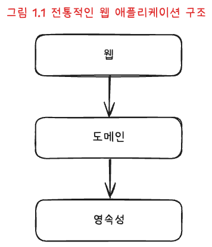
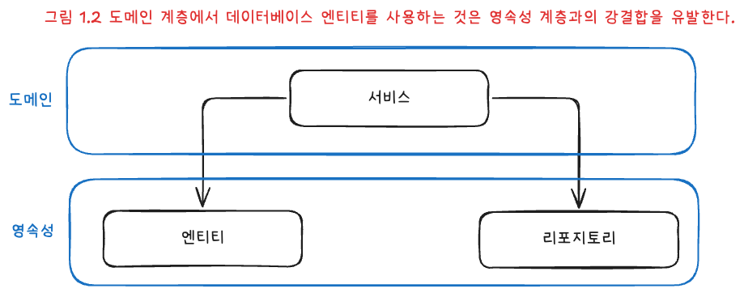
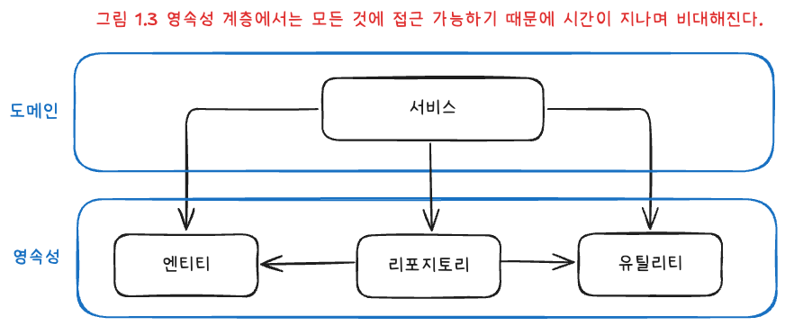
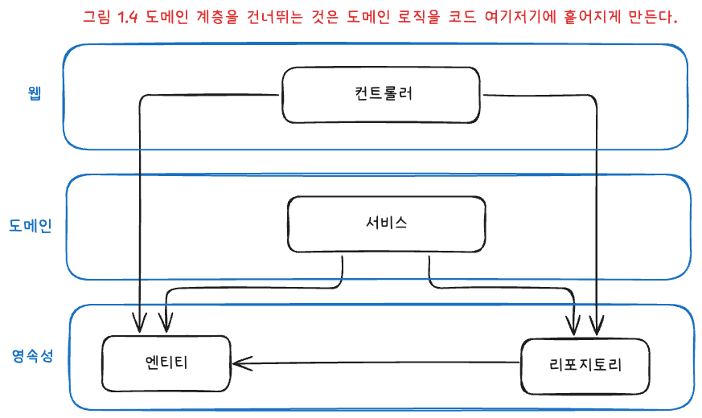
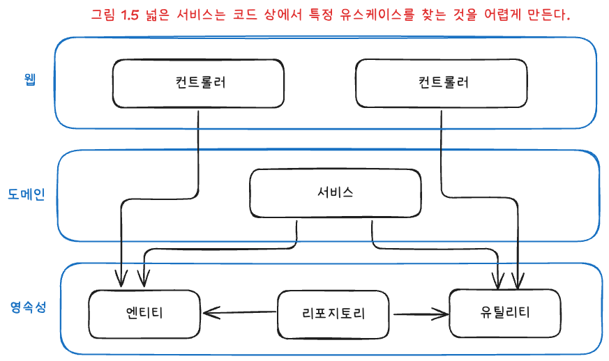

# 계층형 아키텍처의 문제점

위 그림은 상위 수준 관점에서 일반적인 3계층 아키텍처를 표현한 그림이다.

계층형 아키텍처는 코드에 나쁜 습관이 스며들기 쉽고, 시간이 지날수록 소프트웨어를 바꾸기 어렵게 만드는 허점을 많이 드러낸다.

---

## 계층형 아키텍처는 데이터베이스 주도 설계를 유도한다

전통적인 계층형 아키텍처의 토대는 데이터베이스다. 웹 계층은 도메인 계층에 의존하고, 도메인 계층은 영속성 계층에 의존하므로 자연스럽게 데이터베이스에 의존하게 된다.

그 결과 **대부분의 것이 영속성 계층을 토대로** 만들어진다.

**문제:** 비즈니스 관점에서는 도메인 로직을 먼저 만들어야 로직을 제대로 이해했는지 검증할 수 있다. 도메인 로직이 맞다는 것을 확인한 뒤에야 영속성 계층과 웹 계층을 그 위에 얹는 편이 순서에 맞다.

데이터베이스 중심 아키텍처가 되는 큰 원인 중 하나는 ORM 사용이다. ORM을 계층형 아키텍처와 함께 쓰면 비즈니스 규칙을 영속성 관점과 섞고 싶은 유혹을 받기 쉽다.

---

그림 1.2처럼 ORM이 관리하는 엔티티는 보통 영속성 계층에 둔다. 계층은 아래 방향으로만 접근 가능하므로 도메인 계층에서도 이 엔티티에 접근할 수 있고, 접근할 수 있으면 결국 사용하게 된다.

그러면 영속성 계층과 도메인 계층 사이에 강한 결합이 생긴다. 서비스가 영속성 모델을 비즈니스 모델처럼 쓰게 되고, 도메인 로직뿐 아니라 즉시 로딩·지연 로딩·DB 트랜잭션·캐시 플러시 같은 영속성 작업까지 떠안게 된다.

---

## 지름길을 택하기 쉬워진다

전통적인 계층형 아키텍처에서 전체에 공통으로 적용되는 규칙은 하나뿐이다. 특정 계층의 컴포넌트는 같은 계층이나 **아래** 계층에만 접근할 수 있다는 것이다.

상위 계층에 있는 컴포넌트에 접근해야 한다면, 그 컴포넌트를 아래 계층으로 내리면 접근이 가능해지고 문제가 해결된 것처럼 보인다. 한 번 정도는 괜찮을 수 있지만, 첫 걸음이 어렵지 그다음부터는 죄책감이 훨씬 덜하다. 심리학에서는 이를 **깨진 창문 이론**이라고 부른다.

영속성 계층(더 넓게는 최하단 계층)은 컴포넌트를 아래로 내릴수록 비대해진다. 어떤 계층에도 속하지 않는 것처럼 보이는 헬퍼·유틸리티 컴포넌트가 아래로 밀려날 가능성이 크다.

---

## 테스트하기 어려워진다

계층형 아키텍처에서 자주 나타나는 변화의 형태는 **계층을 건너뛰는 것**이다. 엔티티 필드 하나만 바꾸면 되는 경우, 웹 계층에서 곧바로 영속성 계층에 접근하면 도메인 계층을 건드리지 않아도 되지 않을까?

이런 일이 반복되면 두 가지 문제가 생긴다.

1. 필드 하나만 건드리는 일이라도 도메인 로직이 웹 계층에 구현된다.
2. 웹 계층 테스트에서 도메인 계층뿐 아니라 영속성 계층까지 모킹해야 해 단위 테스트가 복잡해진다. 복잡한 설정을 할 시간이 없으면 테스트를 포기하는 쪽으로 기울기 쉽다.

---

## 유스케이스를 숨긴다

개발자는 기능을 추가하거나 바꿀 위치를 자주 찾으므로, 아키텍처는 코드 탐색을 도와야 한다. 그런데 계층형 아키텍처에서는 도메인 로직이 여러 계층에 흩어지기 쉬워 적절한 위치를 찾기 어렵다.

계층형 아키텍처는 도메인 서비스의 **너비**에 대한 규칙을 강제하지 않아, 시간이 지나면 여러 유스케이스를 한꺼번에 담는 아주 넓은 서비스가 생기기도 한다. 

넓은 서비스는 영속성 계층에 많은 의존성을 갖고, 웹 레이어의 많은 컴포넌트가 그 서비스에 의존한다. 그러면 서비스를 테스트하기도 어렵고, 어떤 유스케이스를 담당하는지 찾기도 어렵다. `UserService`에서 사용자 등록 유스케이스를 찾는 대신 `RegisterUserService`를 바로 열어 작업을 시작하는 편이 훨씬 쉽다.

---

## 동시 작업이 어려워진다

적절한 규모에서는 인원을 늘리면 속도가 나온다고 기대할 수 있지만, 그러려면 아키텍처가 동시 작업을 지원해야 한다.

새 유스케이스를 추가한다고 해 보자. 개발자가 세 명이면 한 명은 웹, 한 명은 도메인, 한 명은 영속성을 맡을 수 있을까? 계층형 아키텍처에서는 어렵다. 대부분이 영속성 위에 쌓이므로 **영속성 → 도메인 → 웹** 순으로 진행되는 경우가 많고, 특정 기능은 동시에 한 명만 작업하는 식으로 흐르기 쉽다.

인터페이스를 먼저 정하고 그에 맞춰 구현하면 되지 않냐고 할 수 있지만, 이는 데이터베이스 주도 설계를 피하는 경우에나 현실적으로 통한다. 코드에 넓은 서비스가 있으면 서로 다른 기능을 동시에 다루기 더 어렵다. 서로 다른 유스케이스를 건드리면 같은 서비스를 동시에 편집하게 되고, 병합 충돌과 되돌림까지 이어질 수 있다.

---

물론 잘 설계하고 추가 규칙을 두면 계층형 아키텍처도 유지보수하기 쉽고 변경·추가를 수월하게 할 수 있다.

