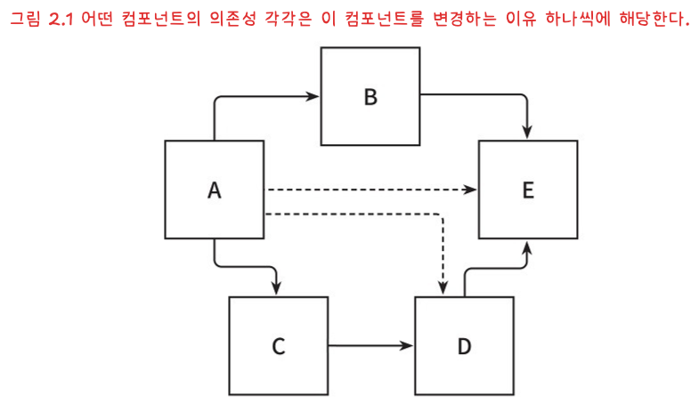
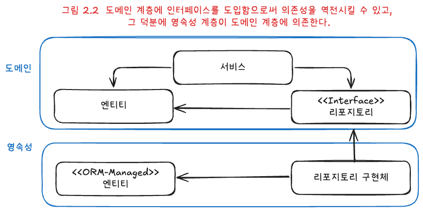
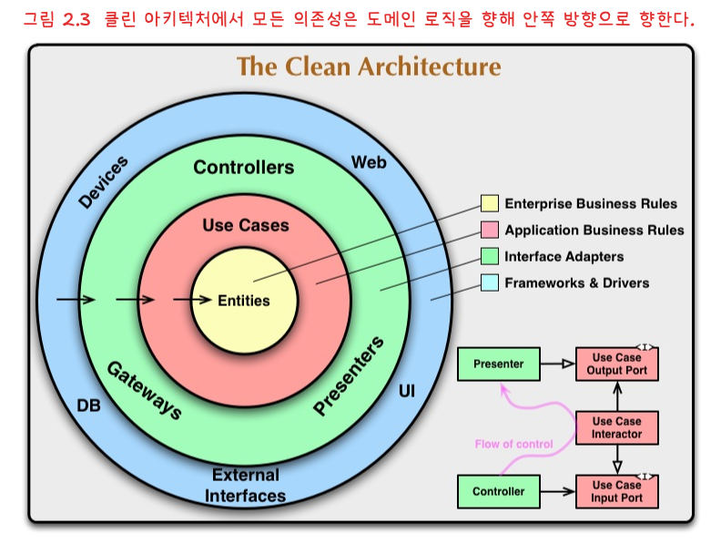
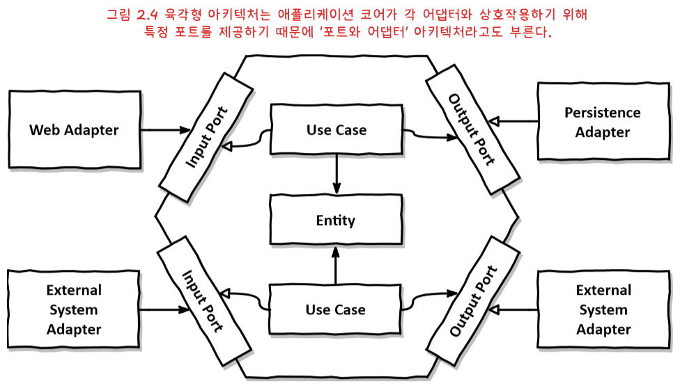

# 의존성 역전하기

## 단일 책임 원칙

- 🔴 **오해:** 컴포넌트는 오직 한 가지 일만 해야 한다.
- 🟢 **실제 정의:** 컴포넌트를 변경해야 하는 이유는 하나여야 한다.

단일 책임 원칙에서 말하는 책임은 "하는 일의 개수"보다 "변경 이유의 개수"에 가깝다.  
컴포넌트의 변경 이유가 하나라면, 다른 요구사항 변화가 생겨도 그 컴포넌트는 안정적으로 유지될 가능성이 높다.

문제는 변경 이유가 의존성을 따라 쉽게 전파된다는 점이다.

그림 2.1처럼 A가 여러 컴포넌트에 의존하면, A는 자신이 담당한 기능 외에도 주변 변화의 영향을 연쇄적으로 받는다.  
반면 E처럼 의존성이 거의 없는 컴포넌트는 자신에게 직접적인 요구사항이 들어올 때만 수정하면 된다.

변경 이유가 누적되면 작은 수정도 예상치 못한 장애를 만들 수 있다.

---

## 의존성 역전 원칙

계층형 아키텍처에서는 보통 의존성이 위에서 아래로 향한다.  
이 구조에서는 상위 계층(예: 도메인)이 하위 계층(예: 영속성)의 변화에 끌려가게 되기 쉽다.

하지만 도메인 코드는 애플리케이션의 핵심 비즈니스 규칙을 담는다.  
영속성 구현이 바뀔 때마다 도메인 코드까지 흔들리는 구조는 피해야 한다.

이때 적용하는 원칙이 의존성 역전 원칙(DIP)이다.

**의존성은 반드시 더 구체적인 구현으로 향할 필요가 없고, 추상(인터페이스)으로 향하도록 뒤집을 수 있다.**

단, 의존성 양쪽 코드를 우리가 제어할 수 있어야 역전이 가능하다.  
서드파티 라이브러리 내부 구현처럼 제어할 수 없는 대상에는 직접적인 역전이 어렵다.

### 의존성 역전 구현

도메인과 영속성 사이의 의존성을 역전해, 영속성이 도메인의 추상에 의존하도록 만든다.

1. 도메인 엔티티를 도메인 계층에 둔다.
2. 도메인 계층에 리포지토리 인터페이스(포트)를 정의한다.
3. 영속성 계층에서 해당 인터페이스를 구현한다.

그러면 도메인은 구현체가 아니라 추상에만 의존하게 된다.

결과적으로 도메인 로직은 영속성 기술의 세부사항으로부터 분리되고, 변경 파급 범위가 줄어든다.

---

## 클린 아키텍처

로버트 C. 마틴은 클린 아키텍처를 통해 비즈니스 규칙이 프레임워크, 데이터베이스, UI, 외부 시스템으로부터 독립적이어야 한다고 설명한다.

즉, 도메인 코드에서 바깥으로 향하는 의존성을 최소화하고, 모든 의존성이 도메인 중심의 코어를 향하도록 설계해야 한다.

이 구조의 핵심 규칙은 의존성 규칙이다.

- 모든 의존성은 안쪽(코어)으로 향한다.
- 코어에는 도메인 엔티티와 유스케이스가 위치한다.
- 바깥 계층은 코어를 지원하는 어댑터 역할을 한다.

유스케이스를 기능 단위로 작게 유지하면, "너비가 넓은 서비스"가 생기면서 책임이 섞이는 문제를 줄일 수 있다.

클린 아키텍처의 대가도 있다.  
도메인 모델과 영속성 모델을 분리하면 계층 간 변환 코드가 필요하고, 초기 구현 비용이 늘어난다.

하지만 이 비용은 도메인 모델을 기술 종속으로부터 보호하는 대가다.  
예를 들어 JPA의 기본 생성자 강제 같은 제약이 도메인 모델을 오염시키지 않게 할 수 있다.

---

클린 아키텍처는 개념적으로 추상적이므로, 이를 구체화한 형태로 자주 소개되는 것이 육각형 아키텍처(헥사고날 아키텍처)다.

육각형 아키텍처에서도 원칙은 동일하다.

- 코어(도메인 엔티티, 유스케이스)는 외부 구현에 의존하지 않는다.
- 주도하는 어댑터(입력 어댑터)는 코어의 인바운드 포트를 호출한다.
- 주도되는 어댑터(출력 어댑터)는 코어가 정의한 아웃바운드 포트를 구현한다.

이렇게 포트를 경계로 의존성을 정리하면, 핵심 비즈니스 규칙을 안정적으로 보호하면서 외부 기술은 유연하게 교체할 수 있다.
