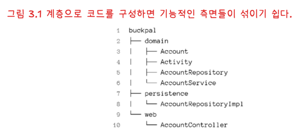
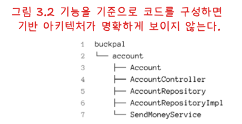
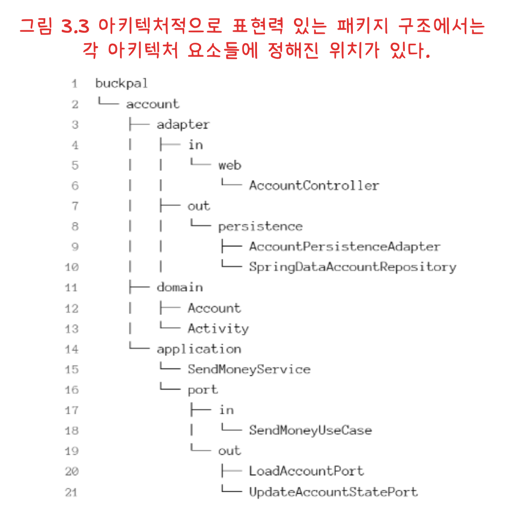
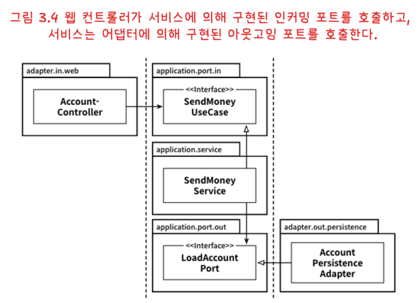

# 코드 구성하기

새 프로젝트에서 초기에 특히 신경 써야 하는 것은 패키지 구조다.

이번 장에서는 사용자가 자신의 계좌에서 다른 계좌로 송금하는 `송금하기` 유스케이스를 예시로, 패키지 구조를 어떻게 잡아야 아키텍처 의도가 코드에 드러나는지 살펴본다.

---

## 계층으로 구성하기

코드를 구조화할 때 가장 흔한 방식은 계층 중심 패키징이다.

의존성 역전 원칙을 적용하면 의존성을 도메인 코드 쪽으로 향하게 만들 수 있다.  
예를 들어 `domain` 패키지에 `AccountRepository` 인터페이스를 두고, `persistence` 패키지에서 `AccountRepositoryImpl`로 구현하면 도메인은 구현체가 아닌 추상에 의존한다.

하지만 이 구조에는 다음과 같은 한계가 있다.

1. 기능 경계가 패키지에 드러나지 않는다.
   - 사용자 관리 기능을 추가하면 `web`, `domain`, `persistence` 각각에 관련 클래스가 흩어진다.
   - 기능 단위 응집이 약해져, 서로 무관한 변경이 예상치 못한 부수효과를 만들기 쉽다.
2. 유스케이스를 파악하기 어렵다.
   - `AccountService`만 보고 어떤 유스케이스를 제공하는지 알기 어렵다.
   - 특정 기능을 찾으려면 서비스와 메서드를 추측하며 탐색해야 한다.
3. 아키텍처 의도가 잘 보이지 않는다.
   - 웹 어댑터가 어떤 인커밍 포트를 호출하고, 영속성 어댑터가 어떤 아웃고잉 포트를 구현하는지 한눈에 드러나지 않는다.
   - 포트와 어댑터가 코드 속에 숨어버린다.

---

## 기능으로 구성하기

다음 선택지는 기능 중심 패키징이다.  
핵심 변화는 계좌 관련 코드를 최상위 `account` 패키지 아래로 모으는 것이다.

이 방식은 기능 단위 응집도를 높이고, `package-private` 접근 제어를 활용해 패키지 경계를 강화하기 쉽다.  
또한 `AccountService`를 `SendMoneyService`처럼 유스케이스 이름 기반으로 좁히면 코드 탐색성이 좋아진다.

다만 기능 중심 패키징만으로는 아키텍처가 충분히 드러나지 않는다.

- 어댑터와 포트가 패키지 구조에 명시적으로 나타나지 않을 수 있다.
- 도메인/영속성 의존성을 역전해도, 구조 차원에서 실수 의존성을 강하게 통제하기는 어렵다.

---

## 아키텍처적으로 표현력 있는 패키지 구조

헥사고날 아키텍처에서 중요한 요소는 엔티티, 유스케이스, 인커밍/아웃고잉 포트, 인커밍/아웃고잉 어댑터다.

표현력 있는 구조는 보통 다음처럼 계층보다 **역할**을 패키지에 반영한다.

- 최상위 `account` 패키지: 계좌 도메인의 바운디드 컨텍스트
- `domain` 패키지: 도메인 모델
- `application` 패키지: 유스케이스 서비스와 포트
- `adapter` 패키지: 웹/영속성 등 입출력 어댑터

예를 들어 `SendMoneyService`는 인커밍 포트인 `SendMoneyUseCase`를 구현하고, 아웃고잉 포트인 `LoadAccountPort`, `UpdateAccountStatePort`에 의존한다.  
`adapter` 패키지는 이 포트들을 호출하거나 구현하는 어댑터(`web`, `persistence`)를 담는다.

패키지가 많아진다고 모두 `public`이어야 하는 것은 아니다.

- 어댑터 구현체는 대체로 `package-private`으로 숨길 수 있다.
- 어댑터가 접근해야 하는 포트 인터페이스는 `public`이어야 한다.
- 도메인 모델은 서비스/어댑터에서 사용해야 하므로 필요 범위에서 `public`으로 둔다.
- 유스케이스 서비스 구현체는 인커밍 포트 뒤에 숨길 수 있어 반드시 `public`일 필요는 없다.

이 구조의 장점은 어댑터 교체가 쉽다는 점이다.  
예를 들어 Key-Value 저장소에서 SQL 저장소로 바꾸려면, 아웃고잉 포트를 새 어댑터에서 구현하고 기존 어댑터를 교체하면 된다.

또한 DDD 관점에서도 매핑이 쉽다.  
상위 패키지는 바운디드 컨텍스트에 대응하고, `domain` 내부에서 엔티티·값 객체·애그리거트 같은 도구를 명확하게 적용할 수 있다.

---

## 의존성 주입의 역할

클린 아키텍처의 핵심 요구사항은 애플리케이션 계층이 인커밍/아웃고잉 어댑터에 직접 의존하지 않는 것이다.

- 인커밍 어댑터(예: 웹): 제어 흐름과 의존성 방향이 같아 비교적 단순하다.
- 아웃고잉 어댑터(예: 영속성): 제어 흐름과 반대 방향으로 의존성을 만들기 위해 의존성 역전이 필요하다.

헥사고날 아키텍처에서는 이 경계를 포트 인터페이스로 표현한다.  
그리고 실제 구현체 연결은 의존성 주입(DI) 컴포넌트가 담당한다.

예를 들어 DI 컴포넌트는 `AccountController`, `SendMoneyService`, `AccountPersistenceAdapter` 인스턴스를 생성하고 연결한다.

- `AccountController`에는 `SendMoneyUseCase` 구현체로 `SendMoneyService`를 주입한다.
- `SendMoneyService`에는 `LoadAccountPort`, `UpdateAccountStatePort` 구현체로 `AccountPersistenceAdapter`를 주입한다.

이렇게 하면 각 컴포넌트는 자신이 필요한 **추상(포트)** 만 알고, 구체적인 구현에는 의존하지 않게 된다.